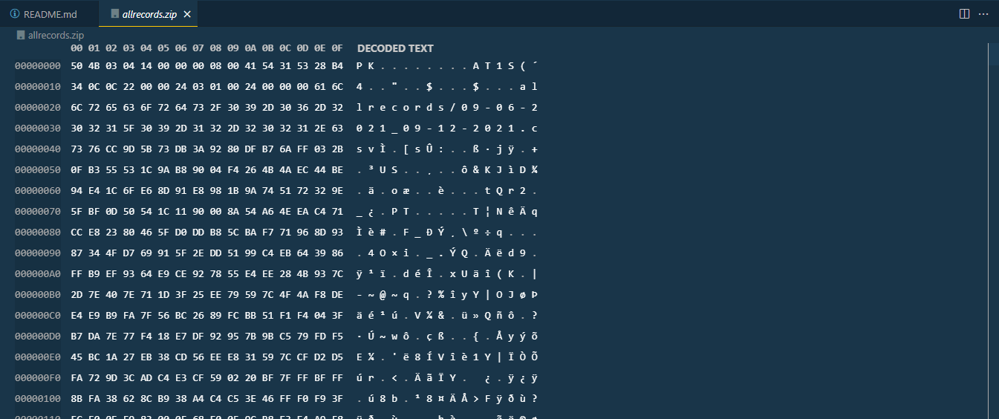

Zip binary specification

My notes from the [Zip File Format Documentation](https://pkware.cachefly.net/webdocs/casestudies/APPNOTE.TXT)

Example File for reference:

# Getting Started on the file
    First 4 bytes (little endian should be 0x04034b50 - in hex editor 50 4B 03 04)

    It appears they expect you to pull the data out 4 bytes at a time to perform logic on zipping/unzipping because every structure that is 2 bytes uses logic from the next 2 bytes to determine their meaning

## Structure of the file format
    [local file header 1]
    [encryption header 1]
    [file data 1]
    [data descriptor 1]
    . 
    .
    .
    [local file header n]
    [encryption header n]
    [file data n]
    [data descriptor n]
    [archive decryption header] 
    [archive extra data record] 
    [central directory header 1]
    .
    .
    .
    [central directory header n]
    [zip64 end of central directory record]
    [zip64 end of central directory locator] 
    [end of central directory record]

## Structure of local file header (4 bytes)
    local file header signature     4 bytes  (0x04034b50)
    version needed to extract       2 bytes
    general purpose bit flag        2 bytes
    compression method              2 bytes
    last mod file time              2 bytes
    last mod file date              2 bytes
    crc-32                          4 bytes
    compressed size                 4 bytes
    uncompressed size               4 bytes
    file name length                2 bytes
    extra field length              2 bytes

    file name (variable size)
    extra field (variable size)

# Version made by and Version needed to extract reference (2 bytes):

## The upper byte indicates the compatibility of the file attribute information:
     0 - MS-DOS and OS/2 (FAT / VFAT / FAT32 file systems)
     1 - Amiga                     2 - OpenVMS
     3 - UNIX                      4 - VM/CMS
     5 - Atari ST                  6 - OS/2 H.P.F.S.
     7 - Macintosh                 8 - Z-System
     9 - CP/M                     10 - Windows NTFS
    11 - MVS (OS/390 - Z/OS)      12 - VSE
    13 - Acorn Risc               14 - VFAT
    15 - alternate MVS            16 - BeOS
    17 - Tandem                   18 - OS/400
    19 - OS X (Darwin)            20 thru 255 - unused

## The minimum supported ZIP specification version is based on feature versions:
    1.0 - Default value
    1.1 - File is a volume label
    2.0 - File is a folder (directory)
    2.0 - File is compressed using Deflate compression
    2.0 - File is encrypted using traditional PKWARE encryption
    2.1 - File is compressed using Deflate64(tm)
    2.5 - File is compressed using PKWARE DCL Implode 
    2.7 - File is a patch data set 
    4.5 - File uses ZIP64 format extensions
    4.6 - File is compressed using BZIP2 compression*
    5.0 - File is encrypted using DES
    5.0 - File is encrypted using 3DES
    5.0 - File is encrypted using original RC2 encryption
    5.0 - File is encrypted using RC4 encryption
    5.1 - File is encrypted using AES encryption
    5.1 - File is encrypted using corrected RC2 encryption**
    5.2 - File is encrypted using corrected RC2-64 encryption**
    6.1 - File is encrypted using non-OAEP key wrapping***
    6.2 - Central directory encryption
    6.3 - File is compressed using LZMA
    6.3 - File is compressed using PPMd+
    6.3 - File is encrypted using Blowfish
    6.3 - File is encrypted using Twofish

In my example on my Windows machine the bits were (14 00) meaning the upper byte was 0 - MS-DOS and OS/2 (FAT / VFAT / FAT32 file systems) and the lower byte was 14 (20 in binary) or (2.0 - File is compressed using Deflate compression, 2.0 - File is encrypted using traditional PKWARE encryption)

# General Purpose Bit flag (2 bytes)

This set of 2 bytes gives us 16 bits with different flags related to the file (mostly related to compression data):

        Bit 0: If set, indicates that the file is encrypted.

#### If Compression Method 6 - Imploding
    Bit 1: If the compression method used was type 6, Imploding, then this bit, if set, indicates an 8K sliding dictionary was used.  If clear, then a 4K sliding dictionary was used.

    Bit 2: If the compression method used was type 6, Imploding, then this bit, if set, indicates 3 Shannon-Fano trees were used to encode the sliding dictionary output.  If clear, then 2 Shannon-Fano trees were used.

#### If Compression Methods 8 or 9 - Deflating
    Bit 2  Bit 1
    0      0    Normal (-en) compression option was used.
    0      1    Maximum (-exx/-ex) compression option was used.
    1      0    Fast (-ef) compression option was used.
    1      1    Super Fast (-es) compression option was used.

#### For Method 14 - LZMA
    Bit 1: If the compression method used was type 14, LZMA, then this bit, if set, indicates an end-of-stream (EOS) marker is used to mark the end of the compressed data stream. If clear, then an EOS marker is not present and the compressed data size must be known to extract.

#### If any other method - Bits 1 and 2 are undefined if the compression method is any other.

### Bit 3 
If this bit is set, the fields crc-32, compressed  size and uncompressed size are set to zero in the  local header.  The correct values are put in the  data descriptor immediately following the compressed data.  (Note: PKZIP version 2.04g for DOS only  recognizes this bit for method 8 compression, newer  versions of PKZIP recognize this bit for any  compression method.)

### Bit 4
Reserved for use with method 8, for enhanced deflating. 

### Bit 5 
If this bit is set, this indicates that the file is  compressed patched data.  (Note: Requires PKZIP  version 2.70 or greater)

### Bit 6
Strong encryption.  If this bit is set, you MUST set the version needed to extract value to at least 50 and you MUST also set bit 0.  If AES encryption is used, the version needed to extract value MUST  be at least 51. See the section describing the Strong Encryption Specification for details.  Refer to the  section in this document entitled "Incorporating PKWARE  Proprietary Technology into Your Product" for more  information.

## Currently unused
### Bit 7 
### Bit 8 
### Bit 9 
### Bit 10

### Bit 11
Language encoding flag (EFS).  If this bit is set, the filename and comment fields for this file MUST be encoded using UTF-8. (see APPENDIX D)

### Bit 12
Reserved by PKWARE for enhanced compression.

### Bit 13
Set when encrypting the Central Directory to indicate selected data values in the Local Header are masked to hide their actual values. See the section describing the Strong Encryption Specification for details.  Refer to the section in this document entitled "Incorporating PKWARE Proprietary Technology into Your Product" for more information.

### Bit 14
Reserved by PKWARE for alternate streams.

### Bit 15
Reserved by PKWARE.

In our example it's `00 00` which likely means the file isn't encrypted

# Different file compression methods
## Legacy Algorithms, no longer recommended
    0 - The file is stored (no compression)
    1 - The file is Shrunk
    2 - The file is Reduced with compression factor 1
    3 - The file is Reduced with compression factor 2
    4 - The file is Reduced with compression factor 3
    5 - The file is Reduced with compression factor 4
    6 - The file is Imploded

## Still usable 
    7 - Reserved for Tokenizing compression algorithm
    8 - The file is Deflated
    9 - Enhanced Deflating using Deflate64(tm)
    10 - PKWARE Data Compression Library Imploding (old IBM TERSE)
    11 - Reserved by PKWARE
    12 - File is compressed using BZIP2 algorithm
    13 - Reserved by PKWARE
    14 - LZMA
    15 - Reserved by PKWARE
    16 - IBM z/OS CMPSC Compression
    17 - Reserved by PKWARE
    18 - File is compressed using IBM TERSE (new)
    19 - IBM LZ77 z Architecture 
    20 - deprecated (use method 93 for zstd)
    93 - Zstandard (zstd) Compression 
    94 - MP3 Compression 
    95 - XZ Compression 
    96 - JPEG variant
    97 - WavPack compressed data
    98 - PPMd version I, Rev 1
    99 - AE-x encryption marker (see APPENDIX E)

In our example the value is `08 00` which means the file is [Deflated](https://en.wikipedia.org/wiki/Deflate) 

# Date and Time Fields 2 bytes each (4 bytes)
    Time and Time are encoded in standard [MS-DOS format]

    File modification time	stored in standard MS-DOS format:
        Bits 00-04: seconds divided by 2
        Bits 05-10: minute
        Bits 11-15: hour
    File modification date	stored in standard MS-DOS format:
        Bits 00-04: day
        Bits 05-08: month
        Bits 09-15: years from 1980

In our example we have 41 54 31 53: 

Meaning for our modification time we have 0x5441 
or `0101 0100 0100 0001`
so our hour is `(0101 0)`100 0100 0001 -> 10 
and our minute 0101 0(100 010)0 0001 -> 34
and our second 0101 0100 010(0 0001) -> 1 -> (1 x 2) = 2

then our modification date we have 0x5331
or 0101 0011 0011 0001 
so our year is (0101 001) 1 0011 0001  -> 41 -> (41 + 1980) = 2021
and our month  0101 001 (1 001) 1 0001 -> 9
and our day is 0101 0011 001 (1 0001)  -> 17

so on 9/17/2021 at 10:34:02 the file was zipped

# CRC-32 checksum value (4 bytes)
In our example 28 B4 34 0C

# Compressed Size (4 bytes)
In our example 0C 22 00 00 -> 0010 0010 0000 1100 -> 12

# Uncompressed Size (4 bytes)

# Extensible Data Fields 
    From the notes: In order to allow different programs and different types of information to be stored in the'extra' field in .ZIP files, the following structure MUST be used for all programs storing data in this field:

       header1+data1 + header2+data2 . . .

   Each header MUST consist of:

       Header ID - 2 bytes
       Data Size - 2 bytes

   Note: all fields stored in Intel low-byte/high-byte order.

   The Header ID field indicates the type of data that is in the following data block.

   Header IDs of 0 thru 31 are reserved for use by PKWARE. The remaining IDs can be used by third party vendors for proprietary usage.